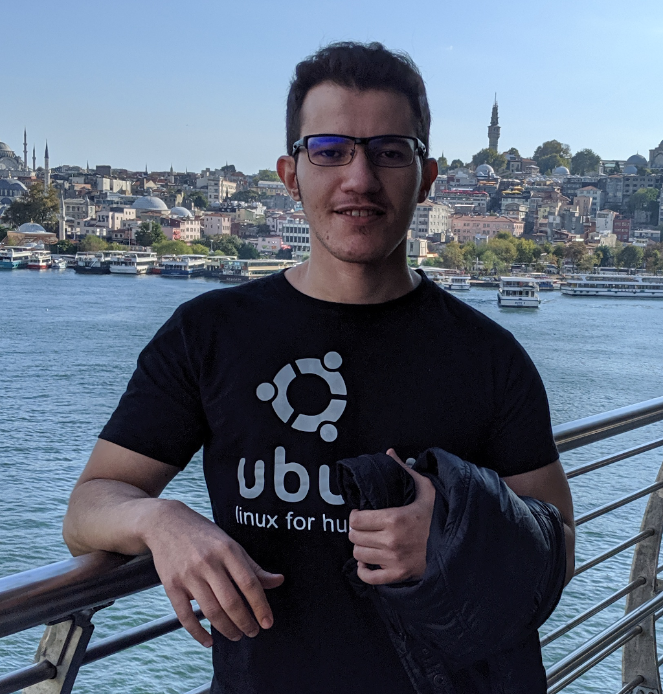

  <a href='https://mrf345.github.io'>
  </img>
  </a>
  <h2>
    <big>Mohamed Feddad  </big>
    <small>Software Engineer</small> 
    <i class='item'><a href='https://github.com/mrf345'>Github - </a></i>
    <i class='item'><a href='https://sourceforge.net/u/freequem/profile'>SourceForge - </a></i>
    <i class='item'><a href='https://pypi.org/user/mrf3/'>PyPI</a></i>  
    <i class='item'><a href='https://npmjs.com/~mrf3'>NPM - </a></i>
    <i class='item'><a href='https://libraries.io/github/mrf345'>Libraries - </a></i>
    <i class='item'><a href='mailto://mrf345@gmail.com'>GMail </a></i>
  </h2>

 

Open-source enthusiast and in love with Python, JS and GNU/Linux. Long time user experience with large variety of Linux distributions as personal machines as well as deployment platforms with experience in Shell Bash scripting and Ansible. Python is the programming language that i'm most passionate about and my first language of choice for almost anything: Desktop applications, Web development, Web scrapping and System adminstration with proven experience working with outstanding libraries like Flask, Django, PyQT, PySide and BeautifulSoup. Javascript is the language that i'm most experienced in and been developing with the longest, Web development back-end with ExpressJS, front-end with standard JS, JQuery, KnockoutJS, ReactJS, Redux, VueJS, Vuex. As well as a minor experience in Android and IOS application development with facebook's React-Native.

<h5><li> Education: </li></h5>

  I. Bachelor of Software Engineering - Limkokwing University (
2014-2017
)  
  II. Masters of Software Engineering - Limkokwing University (
2018-ongoing
)

 

<h5><li> Experience: </li></h5>

I. 
Freelance
: With the Saudi investment bank to develop front-end UI for a game show (
2016/12
)  
II. 
Internship
: With Compos-DZ an Algerian startup as a fullstack engineer (
2017/03-2018/01
)  
III. 
Freelance
: With Nuvonia a Turkish startup as a backend engineer (
2018/04-2018/11
)  
IV. 
Fulltime
: With BriteCore an American fintech company as a fullstack engineer (
2018/11-2019/11
)  

 

<h5><li> Open-Source: </li></h5>

I. 
FQM
: Web based queue management system, built with Python Flask and JQuery (<a href="https://fqms.github.io#download" target='_blank'>Website</a>) (<a target='_blank' href="https://github.com/mrf345/FQM">Github</a>) 
II. 
Safelock
: Cross-platform files encryption desktop application built with PyQT5 (<a href="https://softpedia.com/get/Security/Encrypting/Safelock.shtml" target='_blank'>Softpedia</a>) (<a href="https://downloads.zdnet.com/product/2092-77703546/" target='_blank'>ZDNet</a>) 
III. 
Flask-Minify
: Flask web framework extension to minify HTML response (<a href="https://github.com/mrf345/flask_minify" target='_blank'>Github</a>) (<a target='_blank' href="https://pypi.org/project/Flask-Minify/">PyPI</a>) 

 

<h5><li> Experience in keywords: </li></h5>

`Python3/2 - Django - Django-Rest-Framework - Quart - Flask - Flask-SQLAlchemy - Jinja2 - PySide - PyQt - Gevent - Asyncio - Threading - PyCrypto - Python-ESCPOS - PyInstaller - BeautifulSoup - Unittest - Pytest - Selenium - SQLAlchemy - MySQL - SQLite3 - SQLCipher - MangoDB - Redis - ES9 - TypeScript - jQuery - jQueryUI - KnockoutJS - Less - Sass - Bootstrap - NodeJS - ExpressJS - WebpackJS - BabelJS - VueJS - Vuex - VueRouter - ElementUI - ReactJS - Redux - ReactBootstrap - ReactRouter - ReactNative - Jest - Mocha - GNU/Linux - Bash/Batch Script - Docker - Docker-Compose - AWS - EC2 - Lambda - AWS CodeBuild - Firebase - Firestore - Cloud Functions - Jenkins - Circular-CI - Travis-CI - Jira`
